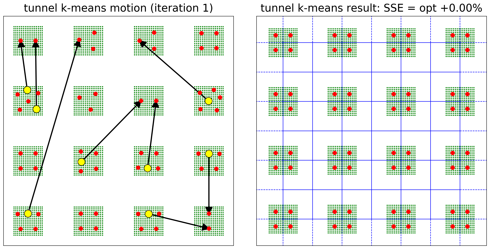

kmeanstf 
========

**k-means** algorithms using **T**\ ensor\ **F**\ low (uses GPU if available):

* *k*-means with random initialization `(Lloyd, 1982) <https://www.semanticscholar.org/paper/Least-squares-quantization-in-PCM-Lloyd/9241ea3d8cb85633d314ecb74b31567b8e73f6af>`_
* *k*-means++ `(Arthur and Vassilvitskii, 2006) <http://ilpubs.stanford.edu:8090/778/1/2006-13.pdf>`_
* tunnel *k*-means (Fritzke, coming soon)

The `k-means <https://en.wikipedia.org/wiki/K-means_clustering#Standard_algorithm_(naive_k-means)>`_ algorithm (a.k.a. "Lloyd's algorithm") and its 
variant `k-means++ <https://en.wikipedia.org/wiki/K-means%2B%2B>`_ are probably the most well-known 
approximation algorithms for the `k-means problem <https://en.wikipedia.org/wiki/K-means_clustering#Description>`_ .

Tunnel *k*-means is a rather new algorithm which differs from the other two by its ability to perform non-local "tunnel" movements 
making  it possible to escape from poor local minima and to find solutions with very low SSE (summed square error). Below is an illustration of the principle. 
A detailed motivation and description can be found in (coming soon).

.. toctree::
   :hidden:
   :maxdepth: 1
   :glob:

   intro
   stubs/*
 
