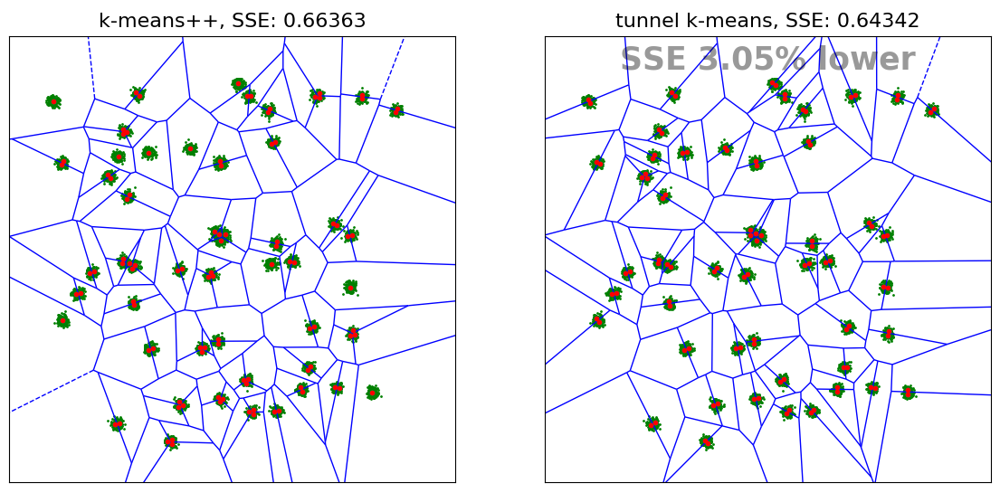
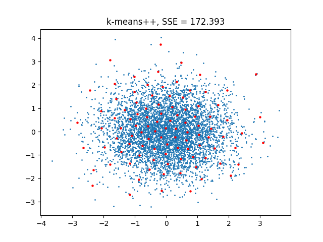

Getting Started
===============

Installation
------------

kmeanstf is available from pypi and can thus be installed using `pip <https://pypi.org/project/pip/>`_:

.. code:: shell

    $ pip install kmeanstf

TensorFlow is required (1.15.0 or 2.0.0+) and will be installed automatically if not present. 
If you have a supported GPU  it is advisable to install ``tensorflow-gpu`` to 
get a speed-up of 4-8 for larger problems (see https://www.tensorflow.org/install/gpu).

Self Test
---------

kmeanstf has a simple self-testing/demo routine which is realized as static member :meth:`.self_test`. 
Per default it generates a random data set from a mixture of Gaussians and runs both *k*-means++ (from scikit-learn)
and tunnel *k*-means. The summed squared error (SSE) and the runtime is printed out and the results are
plotted via matplotlib.

If you execute the following code (with python 3)

.. literalinclude:: examples/selftest.py

a table and a plot are generated:

.. code-block:: shell

    self test ...
    Data is mixture of 50 Gaussians in unit square with sigma=0.00711
    algorithm      | data.shape  |   k  | init      | n_init  |     SSE   | Runtime  | Improvement
    ---------------|-------------|------|-----------|---------|-----------|----------|------------
    k-means++      | (10000, 2)  |  100 | k-means++ |      10 |   0.66363 |    2.23s | 0.00%
    tunnel k-means | (10000, 2)  |  100 | random    |       1 |   0.64342 |    2.81s | 3.05%

Since in this problem the number of centroids (100) is twice as high as the number of Gaussian clusters (50), 
it seems reasonable to position two centroids in each Gaussian cluster. One can note that *k*-means++ leaves 
a number of clusters with only one centroid which leads to a higher SSE than tunnel k-means.

The :meth:`.self_test` method can also be parametrized to have a different mixture of Gaussians (e.g. only 20 Gaussians) 
or a different value of *n_clusters* (a.k.a. *k*). Also an own data set can be provided in parameter *X* (see documentation).

.. _kmp-label:

Using KMeansTF
--------------

The class :class:`.KMeansTF` is a very close equivalent of  scikit-learn's `KMeans <https://scikit-learn.org/stable/modules/generated/sklearn.cluster.KMeans.html>`_ class.

Executing the following code

.. literalinclude:: examples/exrand.py

.. note::

    The parameter ``random_state`` was set to 1 here to seed the random number generators of python, numpy and tensorflow. 
    Thus the generated data set is identical to the following example and the SSE values can be compared.

leads to:

Using TunnelKMeansTF
--------------------

The class :class:`.TunnelKMeansTF` implements the tunnel *k*-means algorithm as described 
in `arXiv:1706.09059 <https://arxiv.org/abs/1706.09059>`_. Its API is very close to scikit-learn's `KMeans <https://scikit-learn.org/stable/modules/generated/sklearn.cluster.KMeans.html>`_ class 
but has some additional optional parameters related to tunnel *k*-means.
 
Executing the  code

.. literalinclude:: examples/exrand2.py

leads to:

The data set used is the same as in :ref:`kmp-label` for *k*-means++. One can note that the SSE of the tunnel *k*-means solution is lower.

